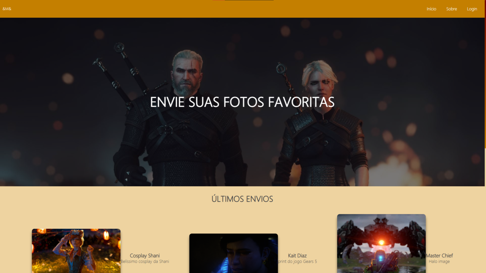

# Site de Upload de Imagens

## O que já está pronto

### Interface

1. Interface de PC e Smartphone prontas
   - Tela inicial exibe as últimas 5 imagens postadas 
   - Tela inicial privada exibe todas as imagens de todos os usuários
   - Tela que exibe sem distorções a imagem clicada, e as informações: titulo e descrição
   - Tela com as imagens postadas pelo usuário
   - Selecionar imagem na área do usuário permite a edição dos dados ou exclusão da imagem
   - Tela de confirmação de exclusão de imagem, e exclusão de usuário

### Sistema de Cadastro

- Validação com email para verificar se já existe no banco

### Sistema de Login

- Validação de email e senha do banco de dados

### Upload de Imagens

- Cada usuário pode ter 5 imagens na conta
- Tela de exibição das imagens do usuário
- Opção de atualizar dados da imagem: título e descrição
- Opção de deletar imagem, que exclui do banco de dados e do diretório/servidor

### CRUD do usuário
- Opção para atualizar os dados da conta: nome, email, senha. Mostra os dados direto do banco.
- Opção para excluir a conta. O usuário deve deletar suas imagens antes.

### Segurança

- Embaralhamento de senha com sha1
- Escape de códigos nos inputs
- Não há como acessar a área privada sem estar logado
- Não há como um usuário acessar a área de edição de outro usuário através da url

## Prints
### Tela inicial deslogada

### Tela inicial logada

### Tela com as imagens do usuário

### Tela pra edição ou exclusão da imagem

### Tela pra edição ou exclusão do usuario
